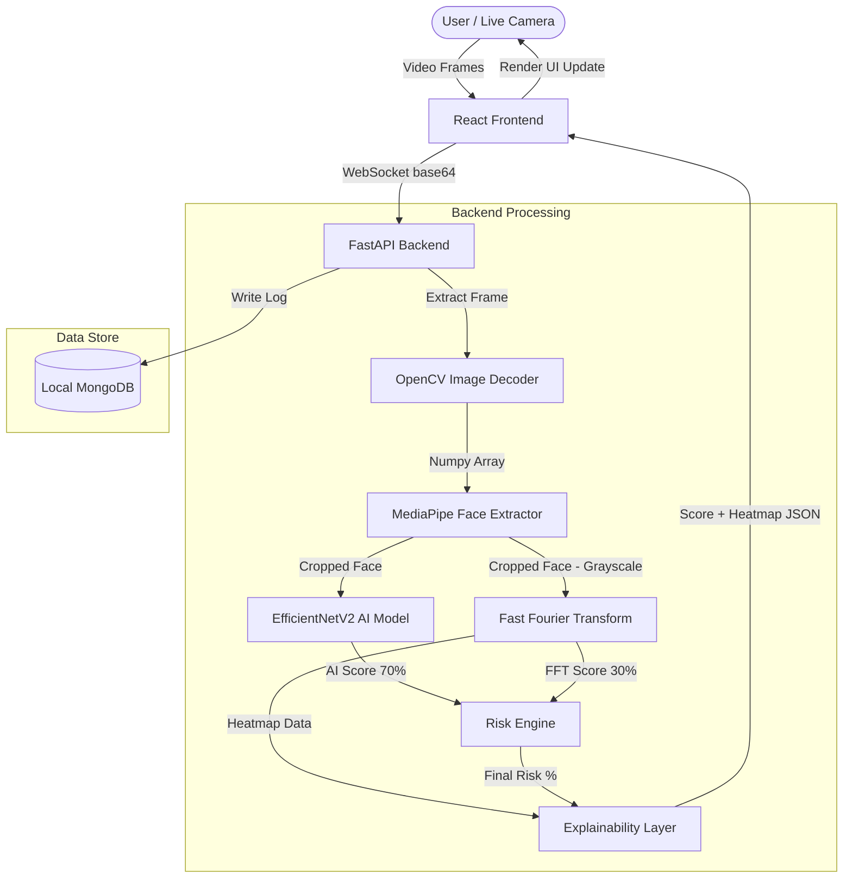
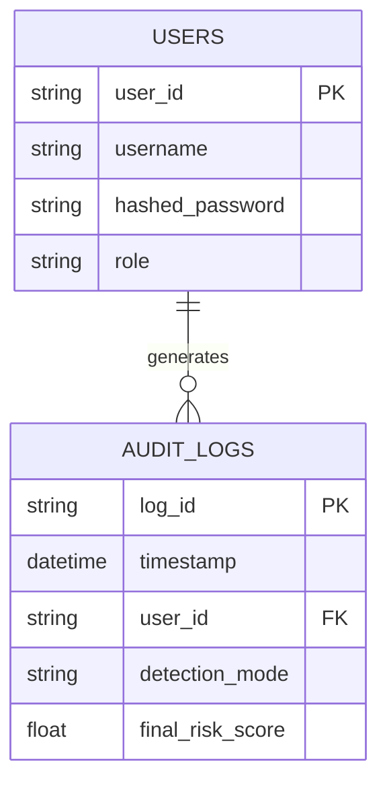

# DeepShield

DeepShield: An Offline Real-Time Deepfake Detection System.

---
Project Demo & Resources


###  Live Video Demo:
Watch the full demonstration of DeepShield in action:
https://drive.google.com/file/d/1HCaYqEEtoGNmnprVg-4qXM0aYBWSu0k5/view?usp=drive_link

### PPT Link
Access the complete project presentation:
https://drive.google.com/file/d/1lCyQP6vv906pUYBmIz_fEUXRa_DMnCMu/view?usp=sharing

### Application Download
Download the DeepShield application here:
https://drive.google.com/drive/folders/1npfY5su88gEZrUe0VCmwt68Id33Zpv0j?usp=sharing

#### Demo video link:
Deepfake : https://drive.google.com/file/d/12gx4binP9n8q2xlVU4slbILe3kNhyR0c/view?usp=sharing
Real Person : https://drive.google.com/file/d/1adxmOOqedL6pDnxiA2kbud8FwBU-UL0b/view?usp=sharing
AI generated : https://drive.google.com/file/d/1adxmOOqedL6pDnxiA2kbud8FwBU-UL0b/view?usp=sharing

## 1. Problem Statement

### Problem Title

Accessible and Privacy-Preserving Deepfake Detection

### Problem Description

Advancements in generative AI have enabled the creation of highly realistic synthetic media, including AI-generated faces in images and videos. Deepfake technology, while innovative, poses serious risks when misused for misinformation, identity fraud, impersonation, and reputational harm. As deepfake tools become more accessible, distinguishing between authentic and AI-generated video content becomes increasingly difficult for the average user.

A specific, glaring problem is the inability to safely verify _live webcam feeds_. Existing detection solutions are almost entirely cloud-based. This means if a user wants to verify the authenticity of a live video call or a sensitive video file, they must upload that private media to a remote third-party server. This exposes the user to massive privacy and security risks. There is a growing, urgent need for transparent, **100% offline, real-time** detection systems that analyze webcam feeds and videos locally, empowering users to verify media authenticity independently without compromising their data.

### Target Users

- Journalists verifying video sources.
- Security personnel during identity verification (e.g., video KYC).
- Individuals seeking to authenticate potentially malicious media.
- Organizations aiming to prevent reputational harm from synthetic media.

### Existing Gaps

- _Cloud Dependency & Privacy Risk:_ Most current solutions require uploading sensitive, private video or live webcam data to remote servers. This is a massive privacy risk for journalists and enterprises.
- _Black-Box Outputs:_ Existing tools provide binary "real/fake" outputs without explaining why the decision was made.
- **Latency on Live Feeds:** Cloud-based inference introduces network latency, making real-time live webcam analysis difficult, laggy, or impossible over slow networks.

---

## 2. Problem Understanding & Approach

### Root Cause Analysis

Current detection methods rely entirely on heavy, server-side neural networks that look for pixel-level blending errors. However, as Generative Adversarial Networks (GANs) improve, these pixel artifacts disappear. Furthermore, relying entirely on AI abstracts the reasoning away from the user, reducing trust.

### Solution Strategy

Our strategy is to build a dual-layered, hybrid offline architecture. We will combine a state-of-the-art Convolutional Neural Network (_EfficientNetV2_) designed to catch mesoscopic pixel artifacts, with a deterministic mathematical layer (Fast Fourier Transform) to analyze high-frequency spectral anomalies. By running both layers entirely locally on the CPU and fusing the scores, we achieve high accuracy, real-time webcam speed, and guaranteed zero-data-leak privacy.

---

## 3. Proposed Solution

### Solution Overview

DeepShield is an offline dual-stack application (React frontend + FastAPI backend) that analyzes either live webcam feeds or uploaded `.mp4` videos. It extracts faces over real-time WebSockets, runs them through our dual-layer AI and Mathematical pipeline, and provides a real-time Risk Score alongside visual heatmaps explaining the detection reasoning back to the UI.


### Core Idea

Move deepfake computing to the edge (local machine) using optimized, lightweight models while augmenting AI predictions with transparent frequency-domain mathematics to increase trust.

### Key Features

- _Live Webcam Detection Mode:_ Analyze live video feeds in real-time, instantly catching deepfakes on camera without any network latency.
- _Video Upload Mode:_ Process standalone `.mp4` files locally.
- _Real-Time Authenticity Meter:_ Live gauges showing confidence percentages.
- _Heatmap Display:_ Visual overlays highlighting the exact facial region triggering the anomaly.
- _100% Offline Operation:_ No API keys, no cloud dependencies, ensuring total privacy.

---

## 4. System Architecture

### High-Level Flow

1. User / Live Camera → React Frontend → WebSocket (`ws://`) → FastAPI Backend → MediaPipe Face Crop → (Parallel) AI Model & FFT Analyzer → Local Scoring Engine → React UI Response
2. _Face Extractor:_ MediaPipe instantly isolates the bounding box of the prominent face, cropping and reshaping it to 256x256 pixels.
3. _Parallel Analysis:_
   - _AI Path:_ A PyTorch model (EfficientNetV2) evaluates the face tensor for pixel inconsistencies.
   - _Math Path:_ Numpy converts the face to grayscale and applies a 2D Fast Fourier Transform to calculate high-frequency energy density.
4. _Risk Engine:_ A weighted scoring mechanism fuses the probability outputs (70% AI, 30% FFT) into a final Confidence Risk percentage.
5. _Explainability Layer:_ OpenCV generates a heatmap from the FFT spectrum. The backend returns this base64 image along with the risk thresholds via WebSocket for the React UI to paint over the original video element.

### Architecture Diagram



---

## 5. Database Design

### ER Diagram



- _Users Table_: `user_id`, `username`, `hashed_password`, `role`.
- _AuditLogs Table_: `log_id`, `timestamp`, `user_id`, `detection_mode` (Webcam/Upload), `final_risk_score`.

### ER Diagram Description

To maintain our strict _100% Offline Privacy Guarantee_, we use **Local MongoDB (Community Server)** running exclusively on `localhost:27017` (No MongoDB Atlas Cloud).

This database is used strictly for User Authentication (login credentials for security guards/journalists) and Audit Logging (recording when a scan happened and the final score). _Video frames and image data are NEVER saved to the database._ They are processed in memory and instantly destroyed to ensure complete privacy.

---

## 6. Dataset Selected

### Dataset Name

FaceForensics++ (and Deepfake Detection Challenge Dataset - for weights reference)

### Source

Technical University of Munich / AWS Deepfake Detection Challenge

### Data Type

MP4 Video clips of real and manipulated faces (Deepfakes, Face2Face, FaceSwap).

### Selection Reason

It is the industry standard benchmark for evaluating facial forgery detection networks.

### Preprocessing Steps

(Pre-training only): Extracting frames, cropping faces via Haar Cascades/MediaPipe, resizing to uniform dimensions (256x256), and applying standard RGB normalization.

---

## 7. Model Selected

### Model Name

_EfficientNetV2_ (Implementation will utilize pre-trained deepfake weights).

### Selection Reasoning

We selected the smaller variants of EfficientNetV2 (e.g., `efficientnetv2_s` or `b0`) because they offer state-of-the-art accuracy while remaining incredibly lightweight. Unlike legacy heavy models (e.g., XceptionNet) which require powerful GPUs and cloud compute, EfficientNetV2 can execute inference in under 200ms on a standard laptop CPU. This perfectly satisfies our strict requirement for real-time, offline live webcam processing.

### Alternatives Considered

- _XceptionNet:_ Rejected due to high computational cost causing latency on CPU.
- _Vision Transformers (ViT):_ Rejected due to being too heavy for local real-time webcam processing.

### Evaluation Metrics

- Frame Processing Time (Target: < 200ms)
- Accuracy (AUC - Area Under Curve on Deepfake datasets)
- False Positive Rate on live, unmodified webcam feed (Target: near 0%).

---

## 8. Technology Stack

### Frontend

- React (or Next.js/Vite)
- TailwindCSS (Styling)
- HTML5 Canvas & WebSockets API

### Backend

- Python 3.10+
- FastAPI (WebSocket & REST API Server)
- Uvicorn (ASGI web server)
- OpenCV (Image processing & Heatmap generation)
- MediaPipe (Face Detection)

### ML/AI

- PyTorch (Model inference)
- NumPy (FFT operations)

### Database

- Local MongoDB Community Server (Running on `localhost:27017` for Auth & Audit Logs)

### Deployment

- Local Execution (Localhost)

---

## 9. API Documentation & Testing

### API Endpoints List

The internal processing pipeline is modular and exposed via a FastAPI server:

- `ws://localhost:8000/stream`: WebSocket endpoint for real-time live webcam frame analysis.
- `POST /auth/login`: REST endpoint for JWT User Authentication via Local MongoDB.
- `POST /analyze/video`: REST endpoint for uploading and processing standalone `.mp4` files.
- `GET /logs`: REST endpoint fetching audit history from Local MongoDB.

### API Testing Screenshots

_Status:_ Pending Phase 4 Backend Integration.
Screenshots from Postman and FastAPI Swagger UI will be uploaded here once the internal logic is connected to the backend routes.

---

## 10. Module-wise Development & Deliverables

### Checkpoint 1: Research & Planning

- _Deliverables:_ Finalized `README.md`, defined library requirements in `requirements.txt`, created GitHub repository.

### Checkpoint 2: Backend Development (Core Vision)

- _Deliverables:_ Implementation of `src/face_detection.py` using MediaPipe to accurately bound and crop faces from OpenCV frames.

### Checkpoint 3: ML Model Integration

- _Deliverables:_ Implementation of `src/model.py`, successfully loading the `.pth` weights into PyTorch and returning prediction scores.

### Checkpoint 4: Math & Scoring Engine

- _Deliverables:_ Implementation of `src/frequency_analysis.py` and `src/scoring.py` to handle the FFT physics layer and fuse the final risk percentage.

### Checkpoint 5: Frontend Development & Explainability

- _Deliverables:_ Implementation of the React UI (`frontend/`) and the FastAPI WebSocket bridge in `main.py`, allowing the backend to stream glowing heatmaps over the webcam feed.

### Checkpoint 6: Deployment & Polish

- _Deliverables:_ End-to-end testing with Wi-Fi disabled, ensuring < 200ms frame latency and smooth React rendering.

---

## 11. End-to-End Workflow

1. User physically launches the Local MongoDB Server, the FastAPI server, and the React frontend (No internet connection required).
2. User authenticates into the React dashboard.
3. User selects "Webcam Mode" or uploads an `.mp4` file.
4. System streams frames via WebSocket to the FastAPI backend, which uses MediaPipe to detect/crop the face.
5. Cropped face is duplicated: Copy A goes to the PyTorch Neural Network, Copy B goes to the Numpy FFT analyzer.
6. Scores are generated instantly (e.g., AI: 0.82, FFT: 0.75).
7. The Risk Scoring Engine weights and combines the input into a final Confidence Metric (e.g., 80% Likely Synthetic).
8. The React UI receives the updated JSON payload via WebSocket, instantly snapping the dashboard dials and overlaying the heatmap explanation.
9. The FastAPI backend asynchronously writes a text-only Audit Log of the event to the Local MongoDB instance.

---

## 12. Demo & Video

- _Live Demo Link:_ (Running Locally via React & FastAPI)
- _Demo Video Link:_ [TBD]
- _GitHub Repository:_ https://github.com/AyushCodes160/DeepFake_Detection-OnlyAIs.git

---

## 13. Hackathon Deliverables Summary

- Fully functional, offline deepfake detection application.
- Modular Python codebase organized cleanly into `src/` modules.
- Dual-factor detection engine (AI + Frequency spectrum math).
- Live React dashboard with FastAPI WebSockets delivering explainable visual heatmaps.

---

## 14. Team Roles & Responsibilities

| Member Name       | Role                          | Responsibilities                                                                       |
| ----------------- | ----------------------------- | -------------------------------------------------------------------------------------- |
| Ayush Kumar       | AI & ML Lead                  | MediaPipe extraction, PyTorch model definition & inference logic.                      |
| Devanshu Prakash  | CV & Explainability Lead      | FFT frequency analysis, Risk Scoring logic, OpenCV Heatmap generation.                 |
| Anirudh Panigrahi | Full-Stack & Integration Lead | React frontend construction, FastAPI WebSocket setup, architecture pipeline alignment. |

---

## 15. Future Scope & Scalability

### Short-Term

- Convert PyTorch (.pth) model to ONNX runtime format to further increase CPU inference speed by 30%.
- Add a visual graph showing the historical anomalies plot over the last 10 seconds of video.

### Long-Term

- Implement multi-face tracking to independently score three or four people in a single frame.
- Integrate audio-spectrum analysis to detect AI voice cloning alongside visual mismatch.

---

## 16. Known Limitations

- _Resolution Dependency:_ Highly compressed, very low-res videos may limit FFT analysis accuracy.

---

## 17. How to Run

### 🖥️ Option A: 100% Offline (Local Execution)

Run the entire application disconnected from the internet. All ML models will run directly on your CPU/GPU natively.

#### Step 1: Clone the Repo & Install Frontend

```bash
git clone https://github.com/AyushCodes160/DeepFake_Detection-OnlyAIs1.git
cd DeepFake_Detection-OnlyAIs1
npm install
```

#### Step 2: Setup Python Backend Environment

Open a new terminal session.

```bash
cd backend
python3 -m venv venv
source venv/bin/activate  # On Windows: venv\Scripts\activate
pip install -r requirements.txt
```

#### Step 3: Fetch Models Locally (One-Time Setup)

You must be online for this single step to fetch the ~1.5GB ML weights down to your hard drive.

```bash
python download_models.py
```

#### Step 4: Run the Application!

You can now **turn off your Wi-Fi**.
Start the FastAPI Backend:

```bash
uvicorn main:app --host 0.0.0.0 --port 8000 --reload
```

Start the React Frontend (in another terminal):

```bash
cd ..
npm run dev
```

### ☁️ Option B: Cloud Deployment (Vercel / Render / AWS)

If deploying the backend to a cloud container, you must ensure the model weights are downloaded during the build step before the server boots.

**Example `CMD` for Docker or Render Build Script:**

```bash
# 1. Install dependencies
pip install -r backend/requirements.txt

# 2. Force the server to download the model weights locally into the container
python backend/download_models.py

# 3. Start the ASGI Server
uvicorn backend.main:app --host 0.0.0.0 --port 8000
```
